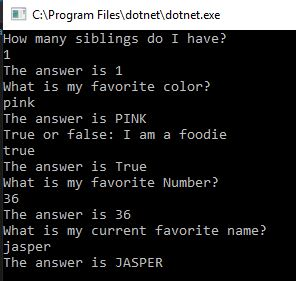
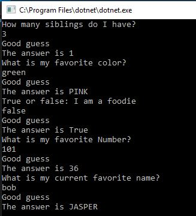
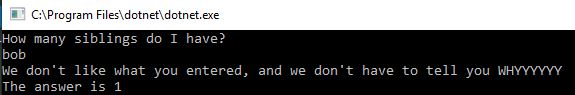

<!--
Note for self for timing: 
- 9:45 AM -11:00, coding
- 11:15 to time, write readme
- time to time, stretch for coding


-->

# About Me

This is a simple program that asks 5 questions about me and takes in your guesses and tells you the correct answer.
No one else would want to use this at this time because it was just an assignment to practice coding a few new topics (like TRY blocks)

## Installing / Getting started

<!--I'm not sure what to fill in here. Like that they need to install VS? Then open the SLN file? -->

When you run the program, it should auto prompt you a question and then it records your answer. It will then inform you of the correct answer regardless if you got it right or wrong. This will repeat 5 times in total.

### Initial Configuration

There are no needed configurations.

## Developing

```shell
git clone https://github.com/JulieLy8619/lab01-aboutme.git
cd lab01-aboutme/
open Program.cs and modify code
```

This will get a copy of my repo on your local machine and allow you to drill into the code to modify it.

### Building

No additional steps to execute this program at this time.

### Deploying / Publishing

No additional steps to deploy or publish this program at this time.

## Features

The current features of this program is that it will ask 5 questions and tell you the answers. 
<!--if I get to stretch then I can add it calcs right and wrong answers-->

This is what it should look like when you run the program:




## Configuration
<!--
Here you should write what are all of the configurations a user can enter when
using the project.

i dont think they need any configurations at this time
-->

#### Argument 
No arguments needed

## Contributing

If you'd like to contribute, please fork the repository and use a feature
branch. Pull requests are warmly welcome.

## Links

No additional links at this time

## Licensing

The code in this project is licensed under MIT license.

